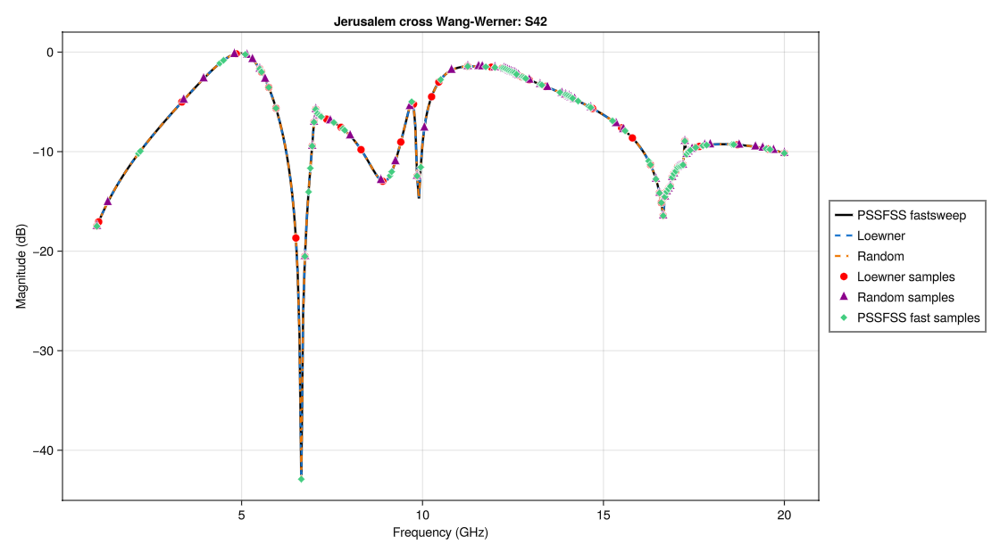

Implementation of adaptive and semi-adaptive sweep algorithms for broadband electromagnetic simulation using the Loewner framework.

Based on:

T. N. Shilpa and R. Sinha, "Fully Adaptive and Semi-Adaptive Frequency Sweep Algorithm Exploiting Loewner-State Model for EM Simulation of Multiport Systems," IEEE Transactions on Microwave Theory and Techniques, vol. 73, no. 9, pp. 6245-6259, Sept. 2025, doi: 10.1109/TMTT.2025.3557208.

S. T. N and R. Sinha, "An Adaptive Frequency Sweep Algorithm for Broadband EM Simulation Incorporating Random Matrix Transformation in the Loewner Framework," 2025 IEEE Microwaves, Antennas, and Propagation Conference (MAPCON), Kochi, India, 2025, pp. 1-4, doi: 10.1109/MAPCON65020.2025.11426247.

The code may later be registered as a standalone module, or included in a sweep library with several methods, if I have inspiration and time.

The directory [examples_pssfss](examples_pssfss) contains examples using [PSSFSS.jl](https://github.com/simonp0420/PSSFSS.jl).

